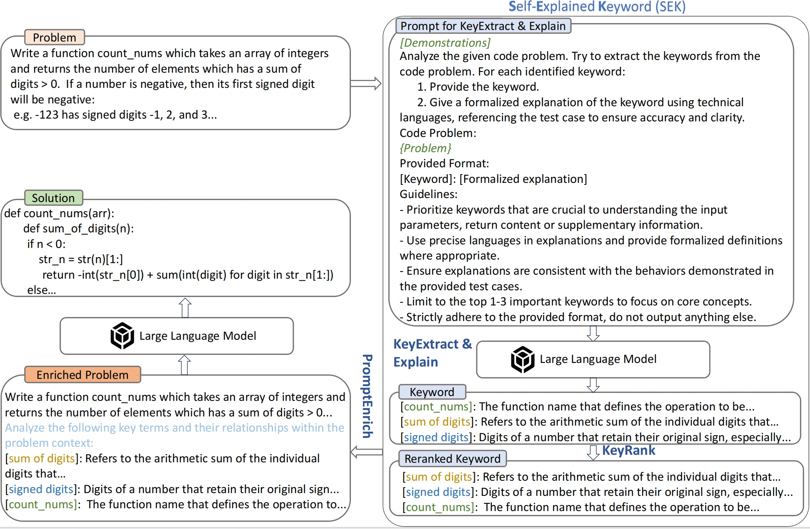

## Self-Explained Keywords Empower Large Language Models for Code Generation

We are happy to introduce [SEK](https://arxiv.org/abs/2410.15966), which is a simple yet effective method that enhances LLMs' code generation by guiding them to extract, explain, and rank key terms from problem statements. SEK works as follows:



The corpus for computing document frequency can be found [here](https://zenodo.org/records/15450326).

### To evaluate SEK on Humaneval(+), MBPP(+), APPS

First install the envirement

```
pip install -r requirements.txt
```


Then run the following commend:

```
python generate.py \
    --model_type "llama-3.1" \
    --model_size "70b-ins" \
    --greedy \
    --root outputs \
    --dataset [humaneval|mbpp|apps-introductory|apps-interview|apps-competition] \
    --backend vllm \
    --with_keywords true
```
When you get the output, run:
```
evalplus.sanitize --samples SAVE_PATH
evalplus.evaluate \
  --dataset $TASK \
  --samples SANITIZE_SAVE_PATH 
```

### To evaulate SEK on BigCodeBench

First go into the bigcodebench dir.
```
cd bigcodebench
```
Then run the following commend:
```
bigcodebench.evaluate \
    --model "Llama-3.1-70B-Instruct" \
    --split  "complete"\
    --subset "hard" \
    --backend vllm \
    --greedy \
    --bs 1 \
```
